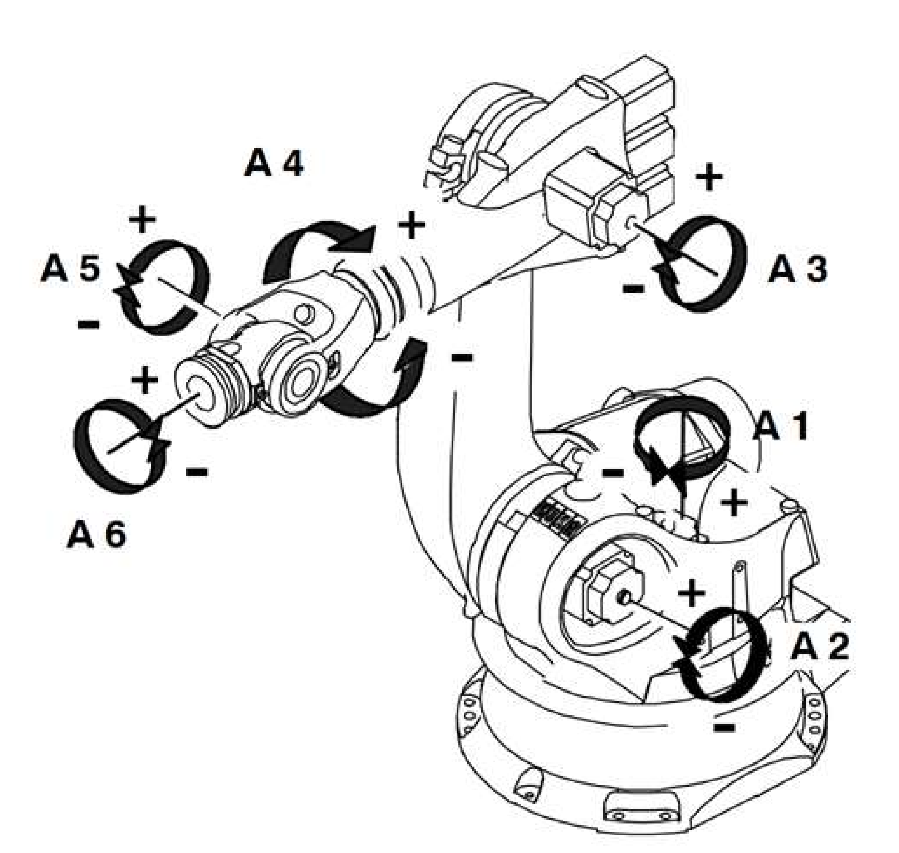

# Méthode de Denavit-Hartenberg

## Enoncé

Dans cet exercice, vous devez :

 - Dessiner la chaîne cinématique du robot.
 - Placer les repères sur la chaîne cinématique en suivant la méthode DHm.
 - Donner le tableau de DHm.
 - Donner la matrice du repère 5 exprimée dans le repère 4.

## Ressources
### Supports de cours
📓 [Robotique-Vision - Thomas Fiolet](../../bib/robotique_vision.pdf){:download}

Un rappel sur les liaisons mécanique est donné de la page 41 à 42. La méthode de Denavit Hartenberg modifié (Khalil-Kleinfinger) est explicitée de la page 47 à la page 49. Des rappels d'algèbre linéaire et de géométrie dans le plan et l'espace sont présents dans les premiers chapitres si nécessaire.

### Livres
📖 [Robotics - T. Bajd, M. Mihelj, J. Lenarcic, A. Stanovnik & M. Munih - (2010)](../../bib/robotics_bajd.pdf){:download}

La modélisation géométrique des robots est donnée dans le chapitre 4 : "Two-segment robot manipulator" sur un cas simple en 2D, de la page 33 à la page 39.