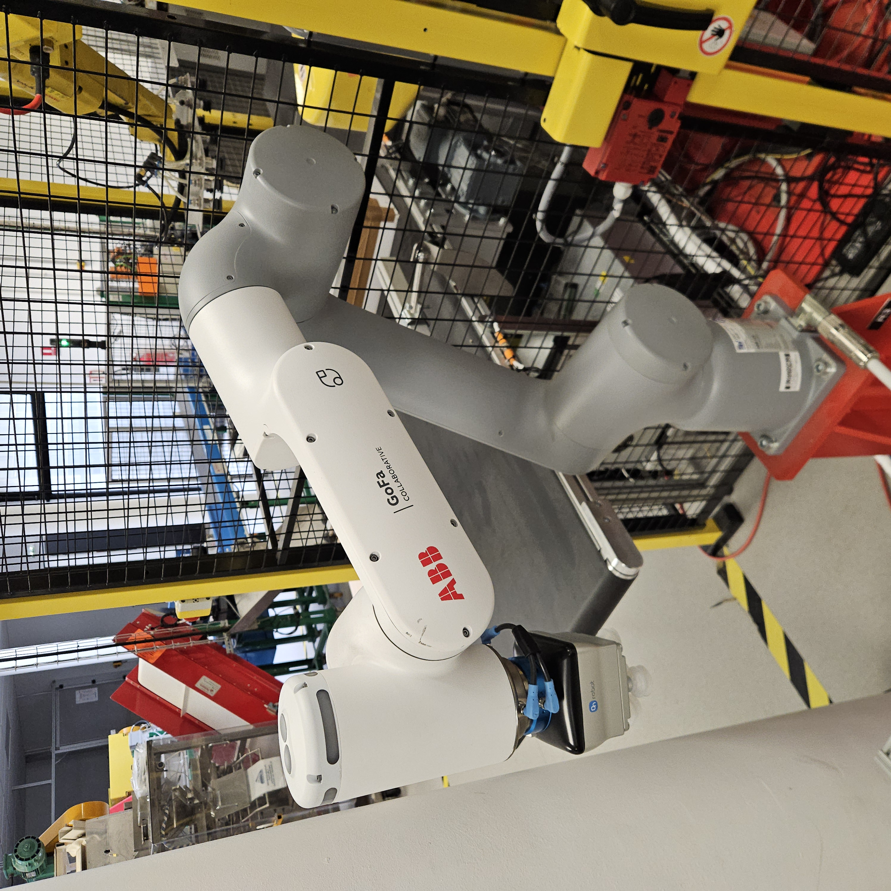

# ABB Gofa (WIP)

## Poste de travail
Ces TP s'effectuent sur l'ABB Gofa, installée à côté de la cellule de suremballage.

## Travail à effectuer
Chaque étape doit être validée par un enseignant avant de passer à la suivante.

### Prise en main du robot
 - Démarrer et éteindre le robot
 - Changer de repère (joint/world/tool/user)
 - Changer de charge utile
 - Modifier la vitesse du robot
 - Déplacer le robot grâce au teach
 - Déplacer le robot à la main
 - (optionnel) Sauvegarder les données sur un support externe

### Création des repères et de la charge utile
 - Créer un repère outil avec la méthode des 3 points
 - Créer un repère outil par entrée directe
 - Créer un repère utilisateur avec la méthode des 3 points
 - Créer une nouvelle charge utile

### Utilisation du robot
 - Utiliser les entrées/sorties (activation/désactivation de la ventouse)
 - Accéder à : la liste des programmes, la page d'édition des programmes et la liste des variables
 - Executer un programme en mode manuel
 - Executer un programme en mode pas à pas

### Création de programme

⚠ Les repères et les charges utiles devront être déclarés dans tous les programmes de mouvement.

 - Créer un programme permettant au robot de saisir un carton depuis le distributeur pour le déposer sur le convoyeur. Avec le mode TP Robots, activable depuis l'IHM de l'armoire électrique, le covoyeur se met en marche automatiquement.
 - Ce programme pourra être tester en même temps que les programmes des robots M10 et M710 de la cellule de surremballage.