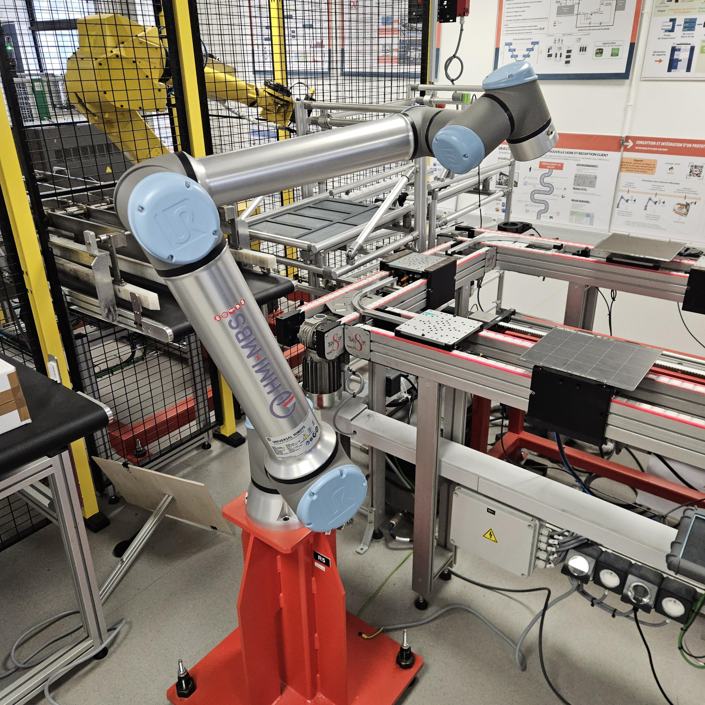

# Universal Robots UR10e

## Liens vers les règles de sécurité et de rangement
 - [Règles de sécurité](../../secu/securite.md)
 - [Règles de rangement](../../secu/rangement.md)

## Poste de travail

## Travail à effectuer
Chaque étape doit être validée par un enseignant avant de passer à la suivante.

### Prise en main du robot
 - Démarrer et éteindre le robot
 - Changer de repère (joint/world/tool/user)
 - Modifier la vitesse du robot
 - Démonter/Installer les outils
 - Déplacer le robot grâce au teach
 - Déplacer le robot à la main
 - Sauvegarder les données sur un support externe

### Création des repères
 - Créer un repère outil (méthode des 3 points)
 - Créer un repère utilisateur (méthode des 3 points)

### Utilisation du robot
 - Executer un programme en mode manuel
 - Executer un programme en mode pas à pas

### Création de programme
 - Créer un programme permettant de suivre les trajectoires données sur les feuilles
 - Executer le programme sur un autre repère utilisateur (plan incliné)