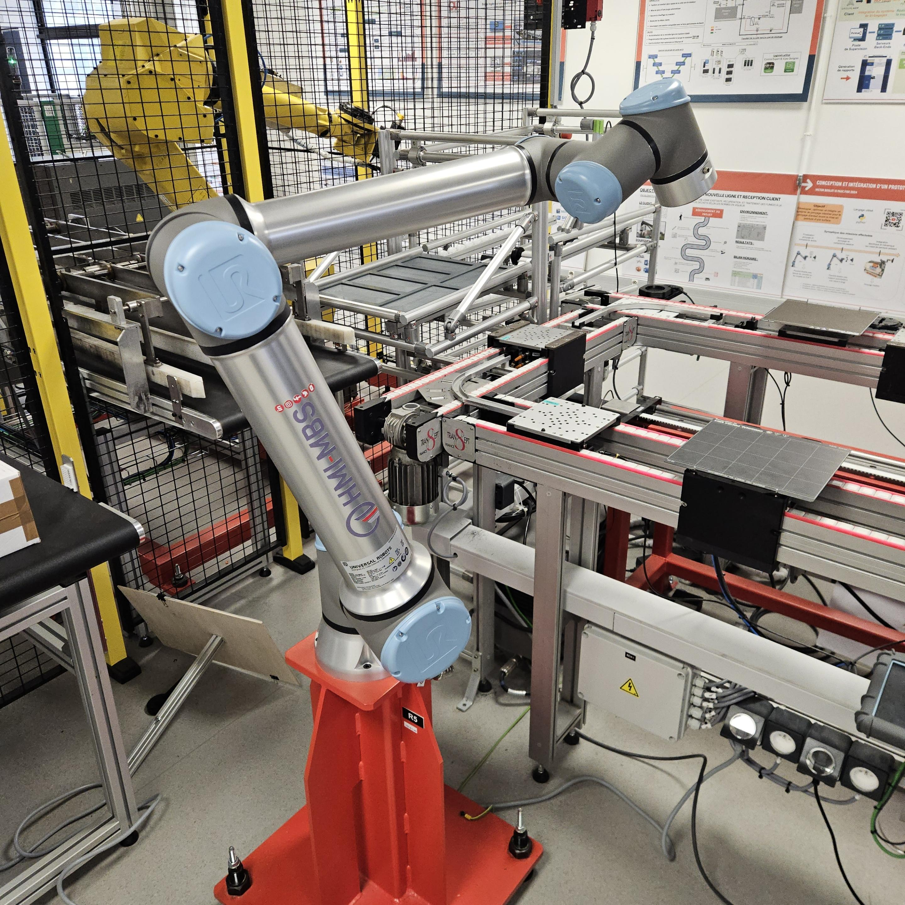

# Universal Robots UR10e

## Poste de travail
Ces TP s'effectuent sur l'un des deux robot UR10e installé autour de l'hypodrôme de la ligne de production robotisée.

## Liens vers les différentes règles à suivre
 - [Règles de sécurité](../../secu/securite.md)
 - [Règles de rangement](../../secu/rangement.md)
 - [Règles sur les livrables](../../secu/redaction.md)

## Travail à effectuer
Chaque étape doit être validée par un enseignant avant de passer à la suivante.

L' objectif de ce TP est de réaliser un programme permettant au robot de suivre une trajectoire déssinnée sur les feuilles mises à disposition, dans deux repères utilisateurs différents. Les feuilles sont attachées à une planche et un profilé, permettant de fixer l'ensemble sur le convoyeur.

### Prise en main du robot
 - Démarrer et éteindre le robot
 - Changer de repère (joint/world/tool/user)
 - Modifier la vitesse du robot
 - Déplacer le robot grâce au teach
 - Déplacer le robot à la main
 - (optionnel) Sauvegarder les données sur un support externe
 - (optionnel) Retirer les outils et les remplacer par un stylet imprimé en 3D
 - (optionnel) Installer les feuille de trajectoire sur les profilé, fixer les profilé sur le convoyeur (marquer la position)

⚠ En cas de changement, les outils retirés du robot doivent être remis à un enseignant.

### Création des repères
 - Créer un repère outil avec la méthode des 3 points
 - Créer un repère outil par entrée directe
 - Créer un repère utilisateur avec la méthode des 3 points
 - Créer une nouvelle charge utile

### Utilisation du robot
 - Ouvrir/Créer un nouveau programme
 - Executer un programme

### Création de programme

⚠ Les repères et les charges utiles devront être déclarés dans tous les programmes de mouvement.

 - Créer différents programmes séquetiels permettant de :
    - Suivre les différentes trajectoire déssinées sur les deux feuilles fournies
 - Créer un programme principal permettant d'executer les uns à la suite des autres les sous-programmes conçus à l'étape précédente
 - Lorsque le programme principal est fonctionnel : incliner le profilé sur lequel la feuille est attachée afin.