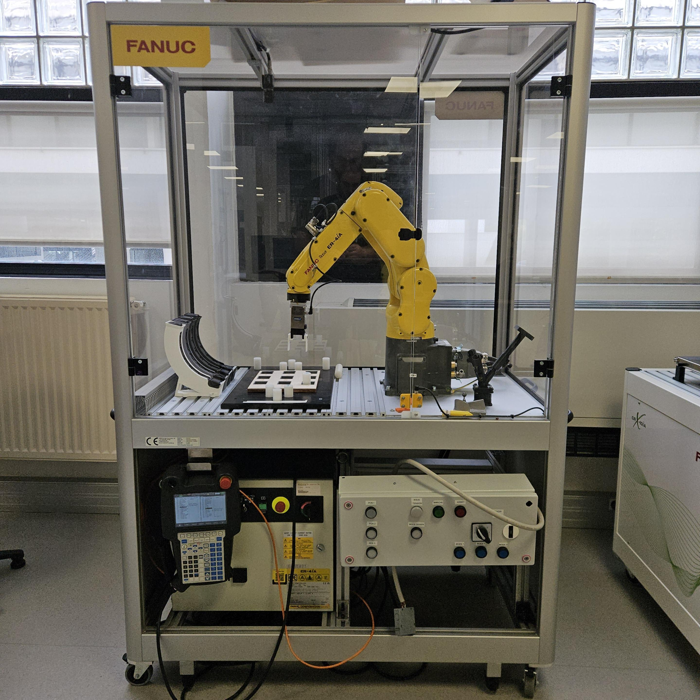

# Fanuc ER-4iA

## Poste de travail
Ces TP s'effectuent sur le Fanuc ER-4iA, installée dans la cellule pédagogique au fond du laboratoire robotique.

## Travail à effectuer
Chaque étape doit être validée par un enseignant avant de passer à la suivante.

### Prise en main du robot
 - Démarrer et éteindre le robot
 - Changer de repère (joint/world/tool/user)
 - Changer de charge utile
 - Modifier la vitesse du robot
 - Déplacer le robot manuellement
 - (optionnel) Sauvegarder les données sur un support externe

### Création des repères et de la charge utile
 - Créer un repère outil avec la méthode des 3 points
 - Créer un repère outil par entrée directe
 - Créer un repère utilisateur avec la méthode des 3 points
 - Créer une nouvelle charge utile

### Utilisation du robot
 - Utiliser les entrées/sorties (ouverture/fermeture de la pince, mise en marche/arrêt du convoyeur, récupération des données capteur)
 - Accéder à : la liste des programmes, la page d'édition des programmes et la liste des variables
 - Executer un programme en mode manuel
 - Executer un programme en mode pas à pas

### Création de programme

⚠ Les repères et les charges utiles devront être déclarés dans tous les programmes de mouvement.

 - Créer différents programmes séquentiels permettant de :
    - Prendre une pièce dans le distributeur et la déposer sur le départ du convoyeur
    - Prendre une pièce sur l'arrivée du convoyeur et la palettiser dans une position donnée (utiliser les registres et registres de position)
    - Prendre une pièce palletisée dans une position donnée et la replacer dans le distributeur

 - Créer un programme principal permettant d'effectuer la palletisation et la dépalletisation en boucle