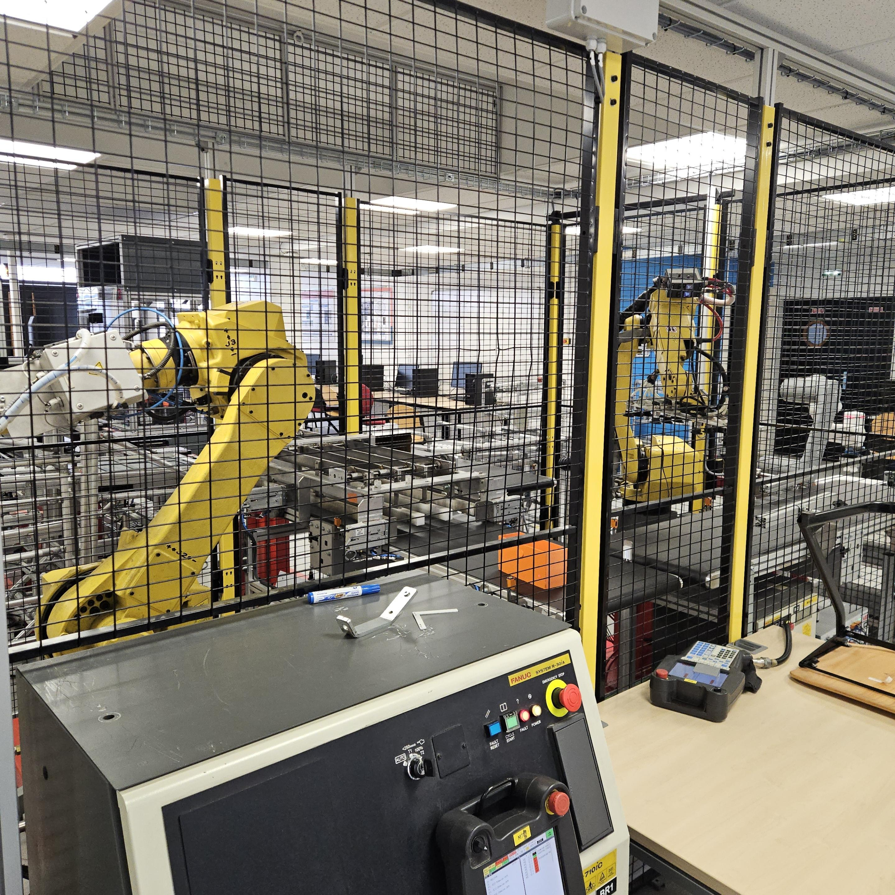

# Fanuc Surremballage

## Liens vers les règles de sécurité et de rangement
 - [Règles de sécurité](../../secu/securite.md)
 - [Règles de rangement](../../secu/rangement.md)

## Poste de travail

## Travail à effectuer
Chaque étape doit être validée par un enseignant avant de passer à la suivante.

### Prise en main du robot
 - Démarrer et éteindre le robot
 - Changer de repère (joint/world/tool/user)
 - Modifier la vitesse du robot
 - Déplacer le robot manuellement
 - Sauvegarder les données sur un support externe

### Utilisation du robot
 - Utiliser les entrées/sorties (communication des deux robots, utilisation des outils)
 - Activer le mode TP Robots
 - Executer un programme en mode manuel
 - Executer un programme en mode pas à pas

### Création de programme
 - Lire et modifier les registres et registres de position
 - Créer deux programmes (un sur chaque robot) communiquants permettant d'effectuer le suremballage des boites dans les cartons