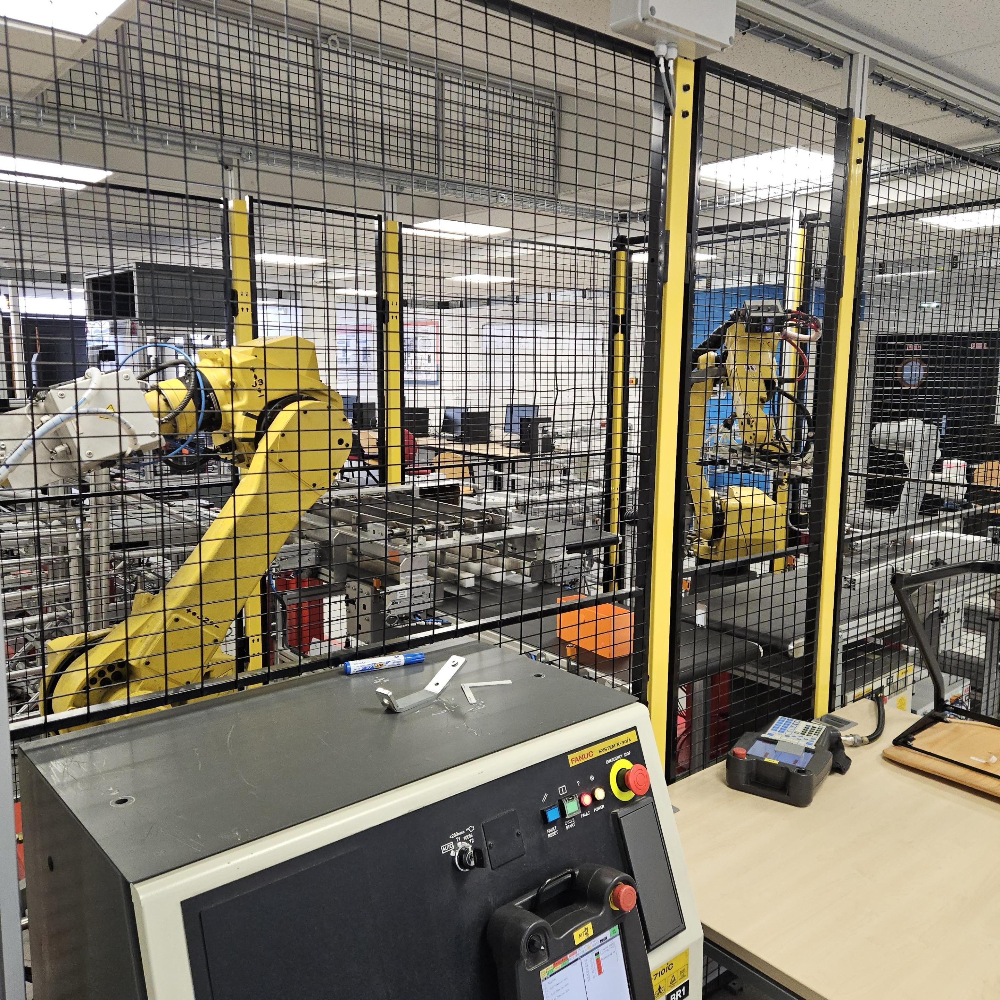

# Fanuc Surremballage

## Poste de travail
Cest TP s'effectuent sur les Fanuc M10 et M710, présents au bout de la ligne de production robotisée. Deux groupes peuvent travailler en même sur ce poste.

## Liens vers les différentes règles à suivre
 - [Règles de sécurité](../../secu/securite.md)
 - [Règles de rangement](../../secu/rangement.md)
 - [Règles sur les livrables](../../secu/redaction.md)

⚠ En raison de la taille et du poids des équipements, il est fortement déconseillé de changer les repères outils et charges utiles des robots. Il est par contre toujours nécessaire de les déclarer dans les programmes.

## Travail à effectuer
Chaque étape doit être validée par un enseignant avant de passer à la suivante.

### Prise en main du robot
 - Démarrer et éteindre le robot
 - Changer de repère (joint/world/tool/user)
 - Changer de charge utile
 - Modifier la vitesse du robot
 - Déplacer le robot manuellement
 - (optionnel) Sauvegarder les données sur un support externe

### Utilisation du robot
 - Utiliser les entrées/sorties (communication des deux robots, utilisation des outils)

⚠ ATTENTION, LA SORTIE NOMMEE "RO[4] DESACOUPLAGE PRE" NE DOIT JAMAIS ÊTRE UTILISEE

 - Activer le mode TP Robots sur l'IHM de l'armoire électrique
 - Accéder à : la liste des programmes, la page d'édition des programmes et la liste des variables
 - Executer un programme en mode manuel
 - Executer un programme en mode pas à pas

### Création de programme

⚠ Les repères et les charges utiles devront être déclarés dans tous les programmes de mouvement.

Sur le M710 :

 - Créer un programme permettant de :
    - Faire avancer une boite sur le convoyeur, en partant du capteur de présence à l'extérieur de la cage, passant par le trieur et s'arrêtant au niveau du capteur de présence présent dans la cage
    - Saisir la boite avec le préhenseur du robot et la placer afin de pouvoir la déplacer à l'intérieur du carton présenté par le M10
    - Revenir en position initiale lorsque le programme est terminé

Sur le M10 :

 - Créer un programme permettant de :
    - Faire avancer un carton sur le convoyeur, en partant du capteur de présence à l'extérieur de la cage, passant par ls guides et s'arrêtant au niveau du capteur de présence présent dans la cage
    - Saisir le carton avec le préhenseur du robot et le placer afin de pouvoir receptionner la boite présentée par le M710
    - Déposer le carton au niveau du capteur de présence du troisième convoyeur
    - Revenir en position initiale lorsque le programme est terminé

⚠ Il faudra faire particulièrement attention entrées/sorties de communication entre les deux robots et entre les robots et les capteur, ce sont ces signaux qui permettent de savoir quand il faut mettre en pause les programmes.

⚠ Les convoyeurs s'activent et se desactivent automatiquement lorsque la présence d'objets est détectée grâce au mode "TP Robot".