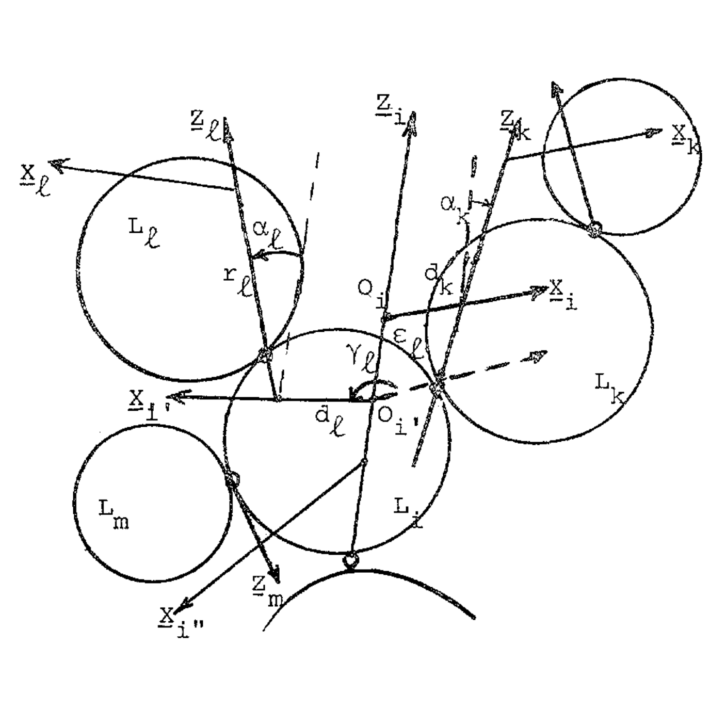
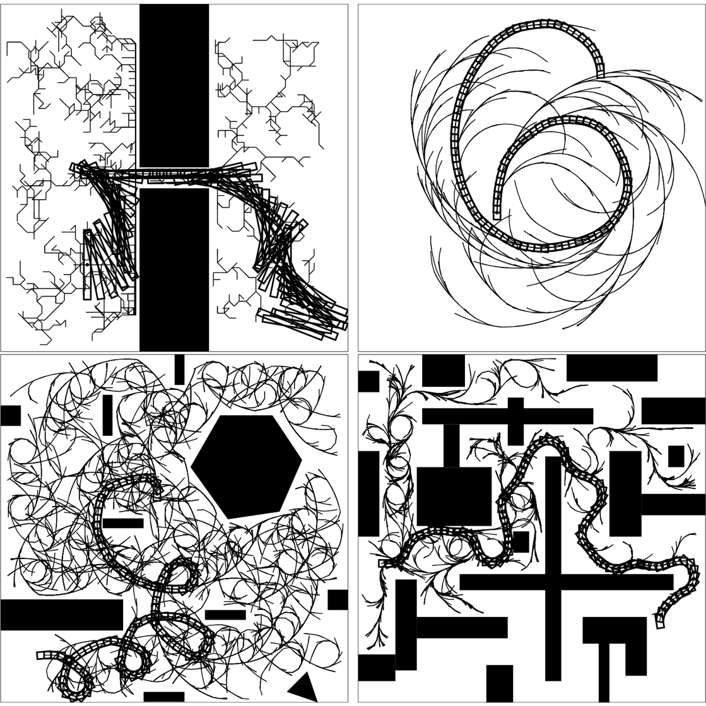
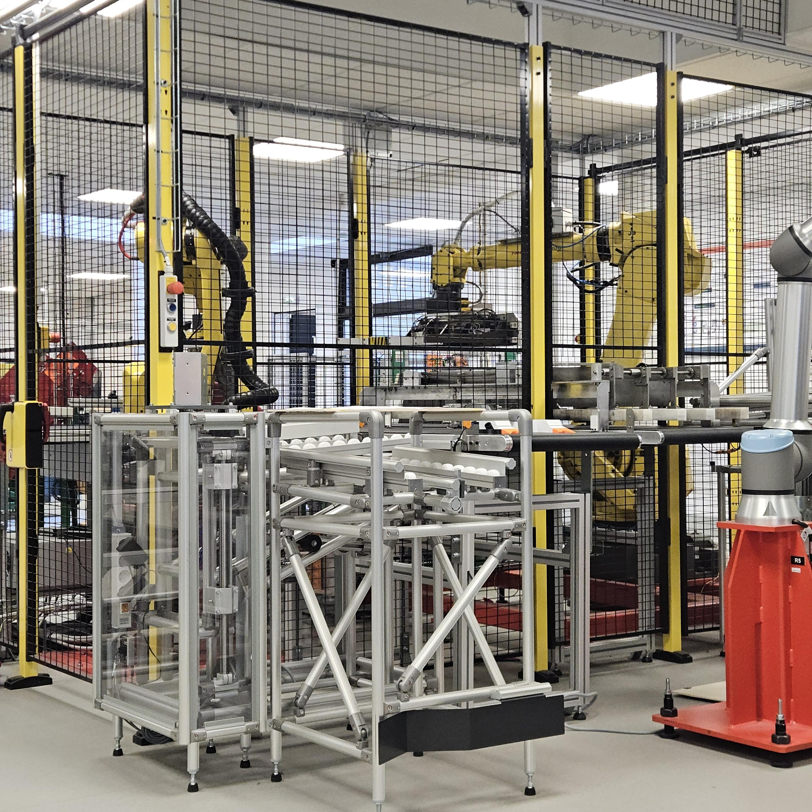
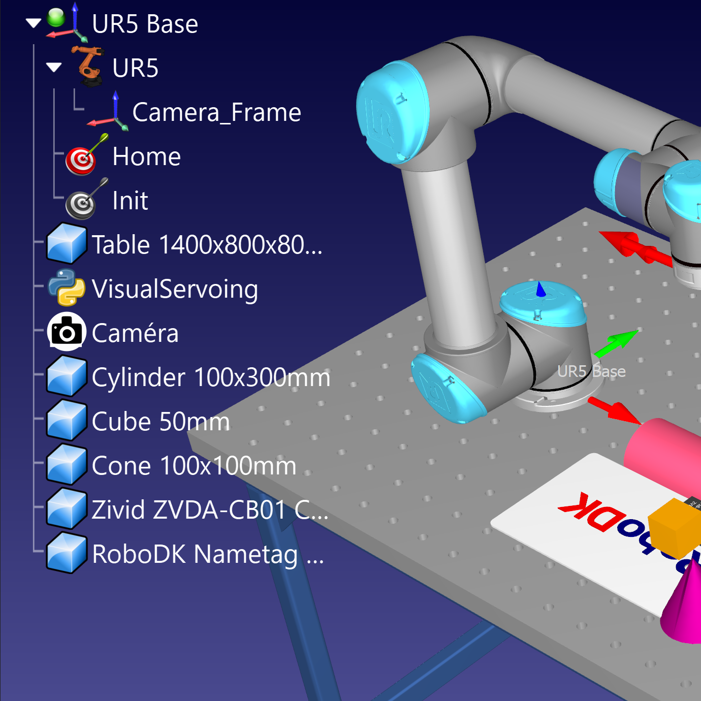
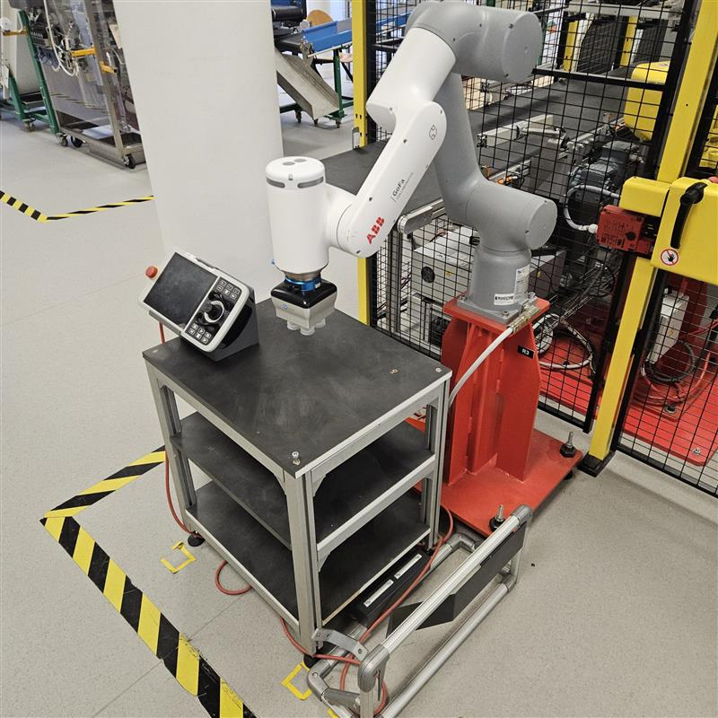
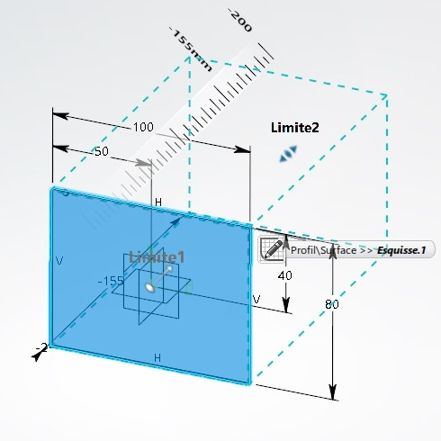

# Robotique

Bienvenue sur le hub UniLaSalle Amiens - PAUC dédié aux enseignements de la robotique.

Le site est en cours de construction, si vous constatez des erreurs ou des informations qui ne sont plus à jour, veuillez les signaler à l'adresse suivante : thomas.fiolet@unilasalle.fr

## Listes des règles de sécurité et de rangement

-   :material-robot:{ .lg .middle } __Règles de sécurité__

    ---

     
    
[Règles de sécurité](secu/securite.md){.md-button}

-   :material-robot:{ .lg .middle } __Règles de rangement__

    ---

     
    
[Règles de rangement](secu/rangement.md){.md-button}

## Organisation des cours

 - [Organisation des cours](organisation/organisation.md)

## Objectifs et exercices à réaliser

### Exercices théoriques

-   :material-robot:{ .lg .middle } __Méthode de Denavit-Hartenberg__

    

    
[Chaîne cinématique](exo/TD/cinematique.md){.md-button_fixed}
    
[Placement des repères](exo/TD/repere.md){.md-button_fixed}
    
[Tableau et matrices](exo/TD/tableau.md){.md-button_fixed}
    
[Méthode complète](exo/TD/denavit-hartenberg.md){.md-button_fixed}

-   :material-robot:{ .lg .middle } __Planification de Trajectoire__

    

    
[TODO](){.md-button_fixed}
    
[TODO](){.md-button_fixed}
    
[TODO](){.md-button_fixed}
    
[TODO](){.md-button_fixed}

### Exercices pratiques

-   :material-robot:{ .lg .middle } __Travaux Pratiques__

    

    
[Fanuc ER-4iA](exo/TP/fanuc-er-4ia.md){.md-button_fixed}
    
[Fanuc Suremballage](exo/TP/fanuc-surremballage.md){.md-button_fixed}
    
[Fanuc CRx](exo/TP/fanuc-CRx.md){.md-button_fixed}
    
[Universal Robots UR10e](exo/TP/UR10e.md){.md-button_fixed}

-   :material-robot:{ .lg .middle } __Projets__

    

    
[Etude d'implantation](exo/PR/implant.md){.md-button_fixed}
    
[Asservissement visuel](exo/PR/asservis.md){.md-button_fixed}

## Tutoriels

-   :material-robot:{ .lg .middle } __Matériel__

    

    
[Fanuc ER-4iA](../tuto/tuto-er-4ia.md){.md-button_fixed}
    
[Fanuc M10/M710 (TODO)](){.md-button_fixed}
    
[Fanuc CRx (TODO)](){.md-button_fixed}
    
[UR10e (TODO)](){.md-button_fixed}
    
[ABB GoFa (TODO)](){.md-button_fixed}

-   :material-robot:{ .lg .middle } __Logiciel__

    

    
[RoboDK (TODO)](){.md-button_fixed}
    
[3D Expérience (TODO)](){.md-button_fixed}
    
[Blender (TODO)](){.md-button_fixed}

## Prérequis

- Algèbre linéaire : calcul matriciel, changements de repères.
- Analyse : intégration, dérivation, changement de variable.
- Géométrie : transformations, projections.
- Mécanique : mécanique du point, cinématique.
- Programmation : algorithmique.
- Anglais : anglais technique.

## Connaissances & Compétences

### Connaissances et compétences de base

- Organisation du travail en groupe.
- Rédaction de rapports.
- Culture générale sur la robotique.
- Connaissance des règles de sécurité et de rangement dans un environnement robotique.
- Fournir un cahier des charges.
- Configuration de cobots et robots industriels six axes en mode manuel : changer et définir les repères, changer la vitesse, modifier les entrées/sorties, variables, etc.
- Utilisation de cobots et robots industriels six axes en mode manuel : déplacer le robot, executer un programmes en mode manueln en mode pas à pas.
- Programmation de robot.
- Vérification de l'atteinte des objectifs et du respect du cahier des charges.
- Modélisation géométrique et cinématique des robots.
- Modélisation géométrique des caméras.

### Connaissances et compétences avancées

#### Industrielles
 - Analyse d'une chaîne de production et définition des problématiques.
 - Proposition de solutions robotisées.
 - Validation de la simulation proposée par simulation.
 - Definition d'un planning et chiffrage de la mise en place de la solution chez le client.

#### Recherche et développement
 - Production d'une bibliographie : utilisation des outils de recherche, selection des articles pertinents, lecture d'articles, etc.
 - Mise en place de méthodes d'études de conception et de validation suivant une démarche scientifique rigoureuse.
 - Simulation et implémentation de solutions proposées dans l'état de l'art.

# Ressources

### Livres
📖 [Robotics - T. Bajd, M. Mihelj, J. Lenarcic, A. Stanovnik & M. Munih - (2010)](bib/robotics_bajd.pdf){:download}

📖 [Robots - John M. Jordan - The MIT Press (2016)](bib/robots_jordan.pdf){:download}

📖 [Modern Robotics - Mechanics, Planning, and Control - Frank C. Park & Kevin M. Lynch (2017)](bib/modern_robo.pdf){:download}

📖 [Probabilistic Robotics - Sebastian Thrun, Wolfram Burgard, Dieter Fox (2005)](bib/proba_robo.pdf){:download}

### Supports de cours
📓 [Robotique-Vision - Thomas Fiolet](bib/robotique_vision.pdf){:download}

📓 [Robotique et cobotique](bib/robo_cobo.pdf){:download}

📓 [Robotique Industrielle - Mehdi Cherif](bib/robo_cobo.pdf){:download}

📓 [Robotique Mobile - David Fillat (2016)](bib/mobile_fillat.pdf){:download}

📓 [Stéréovision - Généralités & géométrie épipolaire - Sebastien Kramm (2016)](bib/stereo_kramm.pdf){:download}

📓 [Vision Algorithms for Mobile Robotics - Lecture 03 - Camera Calibration - Davide Scaramuzza](bib/vis_alg.pdf){:download}

### Articles
📄 [A new geometric notation for open and closed-loop robots - Khalil & Kleinfinger (1986)](bib/khalil_klein.pdf){:download}

📄 [Rapidly-Exploring Random Trees: A New Tool for Path Planning - Steven M. LaValle (1998)](bib/RRT_lavalle.pdf){:download}

### Vidéos
🎞️ [Cours de Robotique - Jacques Gangloff (2016)](https://www.youtube.com/playlist?list=PLMXdciyMZwAAUlCQ_9mVs_CqQ9YaRTptX)

<!-- **Sélectionnez un cours:**

-   :material-robot:{ .lg .middle } __Cours General de Robotique__

    ---

    Découvrez les technologies robotiques modernes et leurs applications dans l'industrie, avec un focus sur la programmation et l’automatisation des tâches complexes. 
    
[Lire le cours](./class/robotique-vision.md){.md-button}

- :material-factory:{ .lg .middle } __Projet Robotique sous 3D Experience__

    ---

    Plongez dans l’univers de la digitalisation des usines, de la simulation des processus à l'intégration des outils de production intelligente à travers le logiciel 3DExperience. 
    
[Lire le cours](./class/Projet_robotique_3DExp.md){.md-button}

 -->