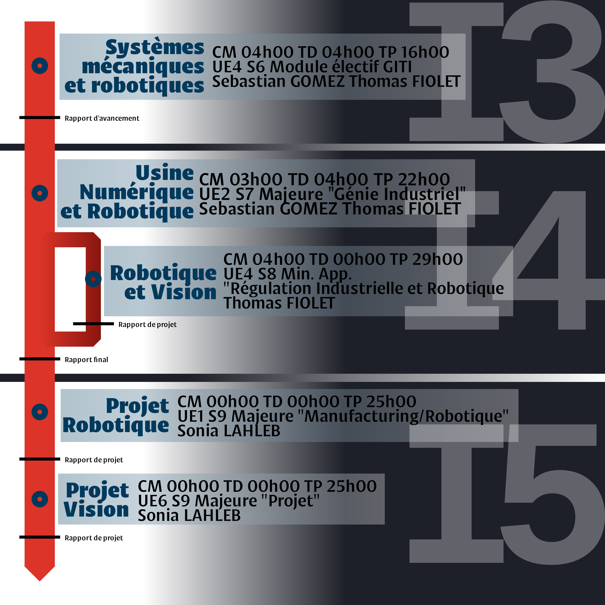
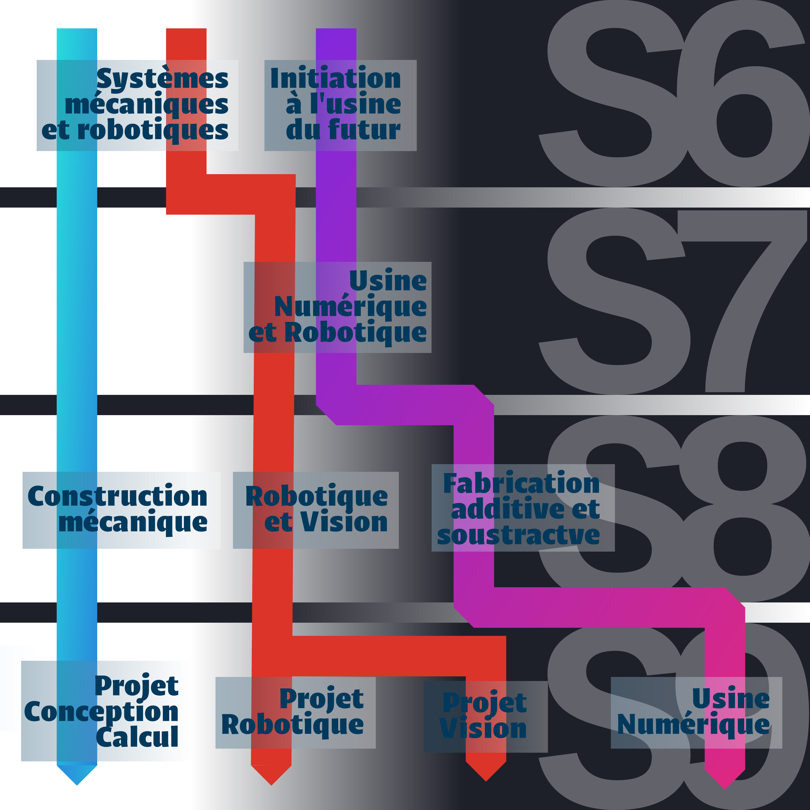

# Organisation générale des cours

## FISE

### I3 GITI

| MODULE | SYSTEMES MECANIQUE ET ROBOTIQUE |
|--: |--- |
| Responsable | Sonia LAHLEB |
| Enseignant(es) | Sebastian GOMEZ, Thomas FIOLET |
| UE | UE4 / S6 / Module électif GITI |
| CM / TD / TP | 04h00 / 04h00 / 16h00 |
| Contenu | Introduction générale à la robotique, formation sur les règles de sécurité et de rangement de l'Usine-Ecole 4.0, manipulation des robots industriels. Ecriture de rapports technique sur le travail fourni. |
| Prérequis | Aucun |

### I4 GITI

| MODULE | USINE NUMERIQUE ET ROBOTIQUE |
|--: |--- |
| Responsable | Thomas FIOLET |
| Enseignant(es) | Sebastian GOMEZ, Thomas FIOLET |
| UE | UE2 / S7 / Majeure "Génie Industriel" |
| CM / TD / TP | 03h00 / 04h00 / 22h00 |
| Contenu | Manipulation, programmation, tests et études théoriques des robots. Ecriture de rapports technique sur le travail fourni. |
| Prérequis | Systèmes mécaniques et robotiques |

---

| MODULE | ROBOTIQUE ET VISION |
|--: |--- |
| Responsable | Thomas FIOLET |
| Enseignant(es) | Thomas FIOLET |
| UE | UE4 / S8 / Mineure d'approfondissement "Régulation Industrielle et Robotique" |
| CM / TD / TP | 04h00 / 00h00 / 29h00 |
| Contenu | Projet d'approfondissement sur la Robotique/Vision. Projet industriel : étude de l'implémentation d'une solution robotisée sur une ligne de production. Projet de recherche et développement : implémentation et simulation d'un algorithme d'asservissement visuel. |
| Prérequis | Usine Numérique et Robotique, Traitement d'Images |

### I5 PAUC

| MODULE | PROJET ROBOTIQUE |
|--: |--- |
| Responsable | Sonia LAHLEB |
| Enseignant(es) | Sonia LAHLEB |
| UE | UE1 / S9 / Majeure "Manufacturing/Robotique" |
| CM / TD / TP | 00h00 / 00h00 / 25h00 |
| Contenu |  |
| Prérequis | Usine Numérique et Robotique |

---

| MODULE | PROJET VISION |
|--: |--- |
| Responsable | Sonia LAHLEB |
| Enseignant(es) | Sonia LAHLEB |
| UE | UE6 / S9 / Majeure "Projet" |
| CM / TD / TP | 00h00 / 00h00 / 25h00 |
| Contenu |  |
| Prérequis | Usine Numérique et Robotique |

## FISA

### I3 PAUC

| MODULE | SYSTEMES MECANIQUES & ROBOTIQUE |
|--: |--- |
| Responsable | Thomas FIOLET |
| Enseignant(es) | Thomas FIOLET |
| UE | UE4 / S5 / Majeure "Mécanique et Robotique" |
| CM / TD / TP | 16h00 / 08h00 / 21h00 |
| Contenu |  |
| Prérequis | Aucun |

### I4 PAUC

| MODULE | ROBOTIQUE |
|--: |--- |
| Responsable | Thomas FIOLET |
| Enseignant(es) | Thomas FIOLET |
| UE | UE2 / S8 / Majeure "Mécanique et Robotique" |
| CM / TD / TP | 08h00 / 00h00 / 28h00 |
| Contenu |  |
| Prérequis | Systèmes Mécaniques & Robotique |

### I5 PAUC

| MODULE | MECANIQUE ET ROBOTIQUE |
|--: |--- |
| Responsable | Thomas FIOLET |
| Enseignant(es) | Thomas FIOLET |
| UE | UE4 / S9 / Majeure "Mécanique et Robotique" |
| CM / TD / TP | 10h00 / 00h00 / 27h00 |
| Contenu |  |
| Prérequis | Robotique |